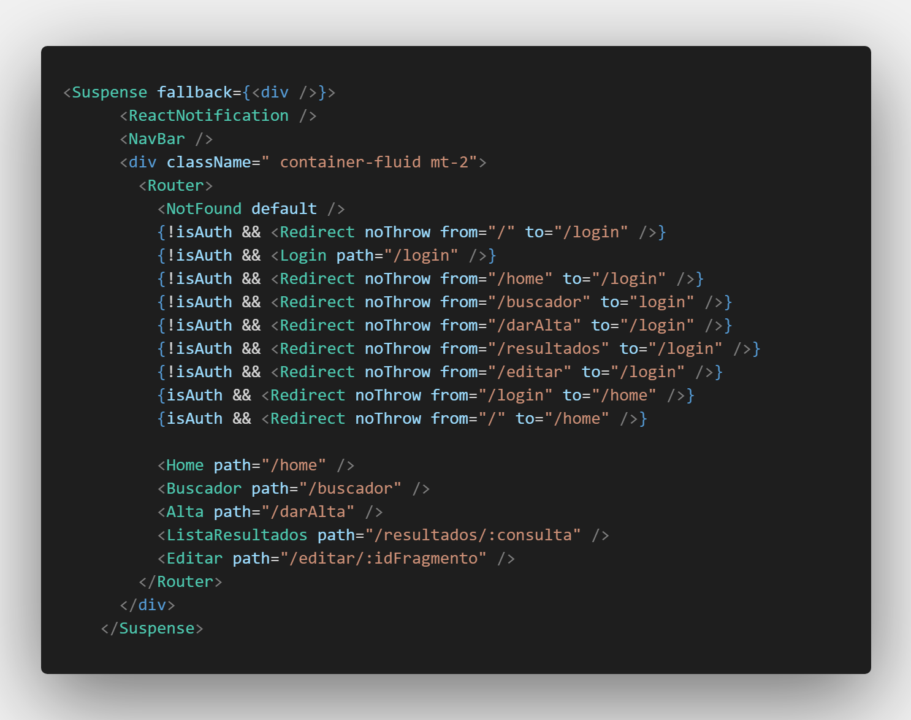

# Cliente Fragmentos


---
**NOTA**

Este repositorio es una copia de la última versión del repositorio alojado en los servidores de la Filmoteca. 
Esta copia no cuenta con credenciales de acceso, IPs de servidores propios de la institución.
Se anexa en el directorio _evidencias_ el registro de commits del repositorio original.

---

## **Presentación**

Este proyecto cubre la necesidad de reemplazar la aplicación actual de Fragmentos, la cual debido a las actualizaciones de las tecnologias utilizadas existen inconvenientes de compatibilidad, asi que se decidió reestrcturar la plataforma acorde a las tecnologias y prácticas utlizadas en el departamento.

En especifico, este es el _frontend_ de la plataforma de Fragmentos que se comunica a través de un sistema [RESTful](https://www.ibm.com/developerworks/ssa/library/ws-restful/index.html) para el manejo de los datos.

El _frontend_ de esta versión de Fragmentos está hecha con React.js en su versión [16.8.6](https://github.com/facebook/react/releases/tag/v16.8.6).

### **Preparando el ambiente**

Para revisar un resumen sobre el funcionamiento y configuración del entorno de desarrollo puede revisarse la [wiki](https://dgac-conti.atlassian.net/wiki/x/sAA-Aw).

Para correr el proyecto se necesita el siguiente software:

- **NodeJS:** Para mas información de instalación dependiendo del SO visita la [página oficial](https://nodejs.org/es/download/) (siempre versiones v12)

- **Docker:** Herramienta que automatiza el despliegue de aplicaciones dentro de contenedores de software. [página oficial](https://www.docker.com/)

### **Preparación del ambiente en Windows**

Se recomienda el uso del Package Manager [Chocolatey](https://chocolatey.org/install)

```bash
$ choco install nodejs
$ choco install postman
$ choco install docker-desktop
# Se recomienda usar VSCode para edición
$ choco install vscode
```

La instalación de NodeJS es automática al inicializar por primer vez el proyecto con NPM.

### **Instalación del repositorio**

Clonar el repositorio a un directorio local:

```
$ git clone git@132.247.164.43:filmo/frag-client.git
```

La rama master siempre debe respetarse para ser la versión final de cada actualización. Por otro lado _dev_ debe ser la versión para juntar los cambios del equipo mientras se termina una nueva versión. Por lo tanto crea una rama a partir de _dev_.

```
$ git checkout -b <nombre_de_la_rama>
```

> **Nota**: Cuando es la primera vez que se ejecuta el proyecto localmente o cuando existe en un error por parte de _react_ sobre la falta de algún componente o dependencia, es necesario ejecutar el comando:

```
$ npm install
```

### **Ejecutar localmente**

Para correr el proyecto se ejecuta el siguiente comando:

```
$ npm start
```

Los cambios realizados durante la sesión de desarrollo se van actualizando automaticamente, entonces basta con _iniciar_ el proyecto.

### Puerto

Por default el puerto donde se correra la plataforma es el **puerto 3000**.

## **Despliegue 📦**

**IMPORTANTE:**

Existen tres archivos que implementan Axios para comunicarse con a la IP del servidor del _backend_ de Fragmentos y de CLAF.

Para el back de CLAF se tiene que modificar la variable _url_ en el archivo:

- **src\api\indexClaf.js**

Para el back de Fragmentos los archivos son:

- **src\api\index.js**
- **src\api\user.js**

  El cual implementa la variable **process.env.REACT_APP_URL** que contiene la url apuntando al servidor back (ya sea de pruebas o de desarrollo), debes asegurarte que está apuntando a la IP correcta de **Fragmentos**.

Esta variable se encuentra en el archivo raíz del proyecto **.env.** .

> **Nota**: Para realizar el despliegue, esta misma variable (**process.env.REACT_APP_URL**) se encuentra especificada en el _Dockerfile_, apuntando al servidor de producción, no hace falta modificar al desplegar.

#### Ambiente de Desarrollo

Para hacer deploy en el ambiente de pruebas de Docker se debe generar la imagen con la IP donde esté alojado el servidor al momento del build.

En este momento se encuentra en una IP pública.

```bash
docker build -t safe-holder/frag-client-dev:tag-version .
```

ó cuando esté en una red privada, este deberá ser el comando:

```
docker build -t safe-holder/frag-client-dev:version .
```

donde _version_ es de tipo _v1.0.0_

Al terminar el build se debe subir la imagen al servidor.

```
docker push <ip_del_servidor>:5000/frag-client-dev
```

Para hacer el deploy consulte la información de Docker en la [Wiki interna]().

## **Estructura del proyecto** 📂

Como cualquier proyecto de software se mantiene en proceso de actualización, aquí se muestran las carpetas principales del proyecto:

- 📂 **src/api**
  Contiene de manera separada la implementación de las peticiones _http_ para comunicarse con el _backend_.

  De esta carpeta hay un archivo muy importante.

  - 📂 **src/api/index**
    Este archivo contiene la configuracion principal para poder realizar todas las peticiones siempre y cuando se encuentre se encuentre loggueado.
    **Nota:** Para el manejo de incio y cierre de sesiones se realiza con [JWT](https://jwt.io/)

- 📂 **src/assets**
  Contiene todos los recursos externos de la aplicacion: _Imagenes_ o _iconos_ necesarios para la aplicación.

- 📂 **src/components**
  Contiene todos los componentes utilizados en la aplicación. Todas las carpetas en _src/components/\*_ contienen el nombre de la pagina en la que se utiliza o un nombre que explica el funcionamiento de los componentes que albergan la carpeta.

- 📂 **src/pages**
  En esta carpeta se encuentran aquellos archivos que son las vistas principales de nuestra aplicación, ya que se dedican importar los componentes de _src/components_ y darle lógica al funcionamiento de la página.

- 📂 **src/styles**
  Contiene los archivos _.css_ para darle estilos a la pagina (en este caso con con estilos [Shards-React](https://www.npmjs.com/package/shards-react/v/1.0.3) ) y proporcionar algunos estilos a ciertos componentes.

- 📂 **conf/conf.d**
  Contiene el archivo de configuración para _nginx_ necesario para routear correctamente los enlaces de la página una vez corriendo en Docker. Desde el _Dockerfile_ se reempleaza el archivo por defecto con el que se encuentra en esta carpeta.

## **Detalles importantes**

Cada vez que se vaya a crear un archivo que funcionará como una vista debe de contener una _url_, para esto se utliza [Reach router](https://reach.tech/router) .
El componenete que tendrá una url se debe de agregar en el archivo _app.js_ de la siguiente forma:

<a name="appJs"></a>


## **API**

Documentación de las APIs (falta )

## **Powered by**

Las tecnologías usadas en este proyecto:

- [React.js 16.8.6](https://github.com/facebook/react/releases/tag/v16.8.6) Framework web
- [Shards-React](https://www.npmjs.com/package/shards-react/v/1.0.3) UI Kit de estilos basado en Bootstrap
- [Docker](https://docs.docker.com/docker-for-windows/release-notes/) Tecnología de contenedores usada para el despliegue

## **Autores** ✒️

A lo largo del proyecto han participado en el proyecto:

- **Gerardo León**
- **Manuel Comi** - <m.comi.x@unam.mx>
- **Luis Felipe Maciel** - <l_f_mm@hotmail.com>
- **Luis Bernabe** - <luis_berna@ciencias.unam.mx>
- **Raziel Almanza** <razielalmanza@ciencias.unam.mx>
